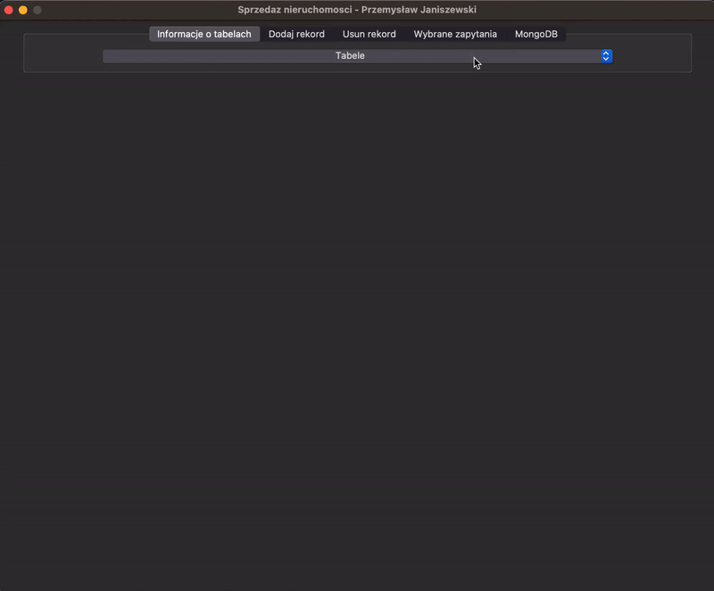

# Estates_database

Final project on the basics of databases, with a graphical interface in Tkinter

--> install Tkinter

> Configure the database accordingly:
> Locally: <a href="https://github.com/przemek890/Estates_database/blob/main/DataBase_file/Database_connect.py#L11-L14">MariaDB</a>
> In the cloud: <a href="https://github.com/przemek890/Estates_database/blob/main/DataBase_file/Database_connect.py#L31-L33">MongoDB</a>

